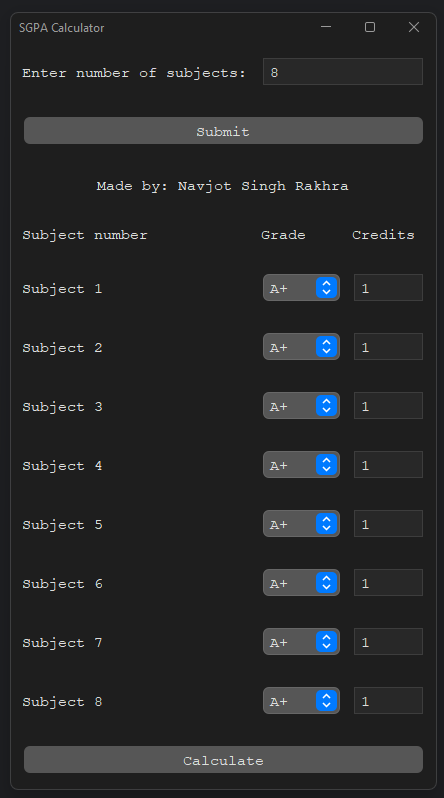
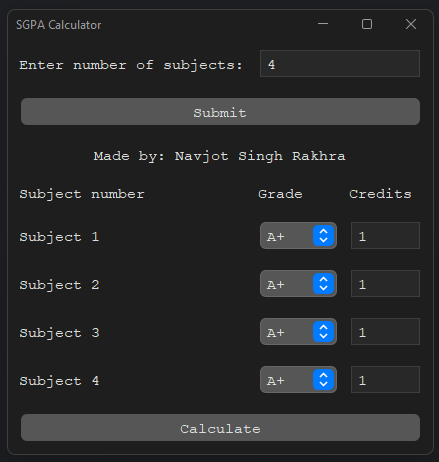
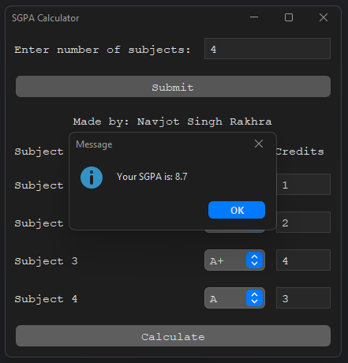

# SGPA Calculator

* [Introduction](#introduction)
* [Download](#download)
* [How to use](#how-to-use)
* [Technologies used](#technologies-used)
* [Dependencies](#dependencies)

# Introduction

This is an application that can be used to calculate the SGPA/GPA of
subjects by entering their grades and credits. It can have any number of
subjects from 1 to 13 but the default number of subjects is 8. It is meant
to work for SGPA calculation for Chandigarh University (CU).

# Download

[Download Windows executable setup](https://github.com/NavjotSRakhra/SGPACalculatorGUI/releases/download/1.1/SGPA_Calculator_Setup.exe)

[Download Java 11+ Jar](https://github.com/NavjotSRakhra/SGPACalculatorGUI/releases/download/1.1/SGPACalculatorGUI.jar)

[Download Android apk file (Android 8 and above)](https://github.com/NavjotSRakhra/SGPACalculatorGUI/releases/download/1.2/SGPA_Calculator_v1.0.5.apk)

To download this application go to the releases section of GitHub page of
this project and download the setup executable if you don't want to install
Java 11+ or you can download the jar file and execute it using the ``java -jar filename.jar`` command.
You can also Download and install the APK to calculate SGPA in android.

# How to use



This is how the UI of the app looks like. You can change the number of
subjects to any integral number between 1 and 13 (both exclusive). The UI
will change accordingly.



Then enter the Grade from the drop-down list. Also enter the credits of
corresponding subject


Finally, click calculate after entering all the respective fields to
calculate SGPA/GPA



# Technologies used

This project has been written in OpenJDK 11 and can run on Java 11 and above.
I also plan on porting it to android.

# Dependencies

This project uses SGPACalculator from maven central. To use it in your own
project add the following to your ```POM.xml```

    <dependencies>
        ...
        <dependency>
            <groupId>io.github.NavjotSRakhra</groupId>
            <artifactId>SGPACalculator</artifactId>
            <version>1.0</version>
        </dependency>
        ...
    </dependencies>
